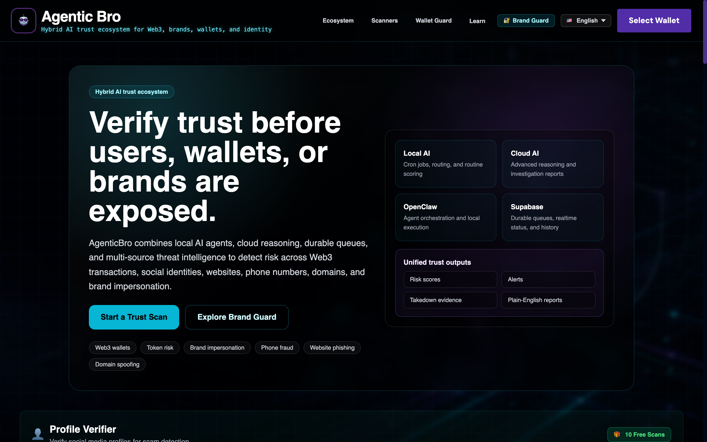
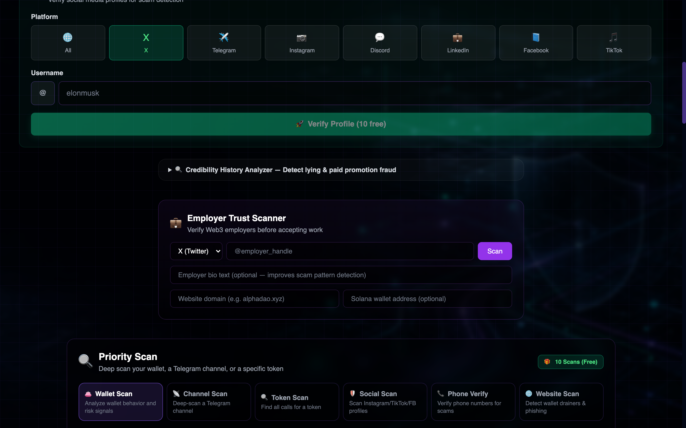
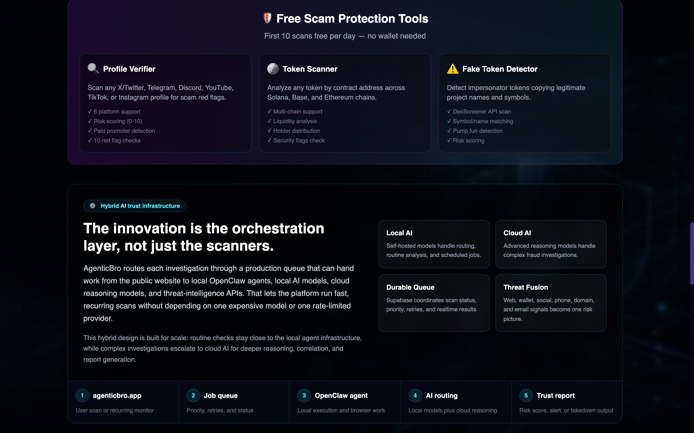

# 🛡️ AgenticBro — AI Trust Intelligence Platform

**Hybrid AI trust intelligence for scam detection, brand protection, and online fraud prevention.**

**Live:** [agenticbro.app](https://agenticbro.app) · **Built by:** Agentic Insights LLC · Earl B. Finney Jr.

<p align="center">
  
  <br/>
  
  <br/>
  
</a>
</p>

---

## What This Is

AgenticBro is a production trust-intelligence platform that detects scams, brand
impersonation, and fraud across the surfaces where they actually happen: social
platforms, lookalike domains, spoofed email, malicious websites, phone numbers, and
crypto wallets/tokens.

**Brand Guard**, the platform's B2B product, monitors businesses across all of these
channels in real time and generates ready-to-submit takedown reports — enterprise-grade
brand protection priced for SMBs (the incumbent tools start at $299–$10,000/month;
Brand Guard tiers run $29–$199/month).

The platform runs on a **hybrid AI architecture**: local open-weight models (Ollama /
Qwen3) handle high-volume classification, while frontier cloud models (Claude,
GLM-5) handle threat-intelligence reasoning and report generation, coordinated
through a durable job queue and a multi-agent orchestration layer.

---

## Core Capabilities (all live)

| Capability | What it does |
|---|---|
| 🔍 **Impersonator Scan** | Detects fake accounts mimicking a brand across X, Instagram, TikTok, Facebook, LinkedIn, and Telegram using browser automation + behavioral AI scoring |
| 🌐 **Domain Monitor** | Watches Certificate Transparency logs for lookalike registrations (TLD swaps, phishing prefixes/suffixes) — catches fake domains at registration, before the site goes live |
| 📧 **Email Spoof Check** | Full SPF/DKIM/DMARC/MX analysis scored on a 100-point scale with PROTECTED→CRITICAL ratings |
| 🌍 **Website Scan** | Deep-scans any URL for phishing indicators and malware signals via a durable job queue |
| ⚡ **Threat Correlate** | Fuses signals across channels — social, domain, email, phone — into a unified campaign risk score |
| 📞 **Vendor Verify** | Phone fraud detection: 12-signal, 90-point scoring engine with VOIP/disposable/spoof detection, FTC complaint data, and STIR/SHAKEN analysis |

**85+ passing tests · 100% coverage on the social verification service.**

---

## Architecture

```
┌─────────────┐ ┌──────────────────┐ ┌────────────────────────┐
│ React app │ → │ Express API + │ → │ Hybrid AI inference │
│ (dashboard) │ │ Supabase durable │ │ • Local: Ollama/Qwen3 │
│ │ │ job queue (RLS) │ │ • Cloud: Claude, GLM-5 │
└─────────────┘ └──────────────────┘ └────────────────────────┘
 │
 Scan services: browser automation (CDP),
 CT-log monitoring, DNS analysis, phone
 intelligence, wallet/token risk scoring
```

- **Frontend:** React + TypeScript + TailwindCSS
- **Backend:** Node.js / TypeScript / Express
- **Data:** Supabase (PostgreSQL + row-level security), Redis
- **AI routing:** local-first inference with cloud escalation for
 reasoning-heavy tasks; threat briefs generated via the Claude API
- **Payments:** Stripe + USDC (Solana and Base)

## Current Constraint (why we're raising non-dilutive funding)

The platform is production-live on a single inference node. Scan bursts across six
surfaces regularly exceed cloud LLM rate limits, forcing fallback to smaller local
models and degrading output quality at exactly the moments demand is highest. The
near-term roadmap is an **adaptive orchestration layer** that routes each job across
the local/cloud model mesh based on rate-limit headroom, queue depth, and required
output quality — plus the compute headroom to make the local tier a true peer.

---

## Roadmap

**Now:** billing completion · domain-monitoring cron · takedown report generator
**Next:** marketplace scanning (Shopify/Etsy clone-store detection) · pHash visual
fingerprinting · alerting (email/Telegram)
**Research track:** quality-aware adaptive routing across hybrid local/cloud LLM
inference under rate constraints

---

## Target Market

$64B+ brand-protection market. Primary verticals: ecommerce/Shopify merchants,
healthcare SMBs, fintech/Web3, professional services, SaaS/EdTech — the segment
priced out of ZeroFox/BrandShield-class tooling.

---

## Development

```bash
npm install
npm test # 85+ tests
cd aibro && npm run dev
```

Requires Node 18+, a Supabase project, and either a local Ollama instance or
cloud model API access. See `.env.example`.

---

## Contact

**Earl B. Finney Jr.** · Founder, Agentic Insights LLC
agenticbro@agenticbro.app · [LinkedIn](https://linkedin.com/in/earl-finney-60259a4)

*One Shield. Total Protection.*